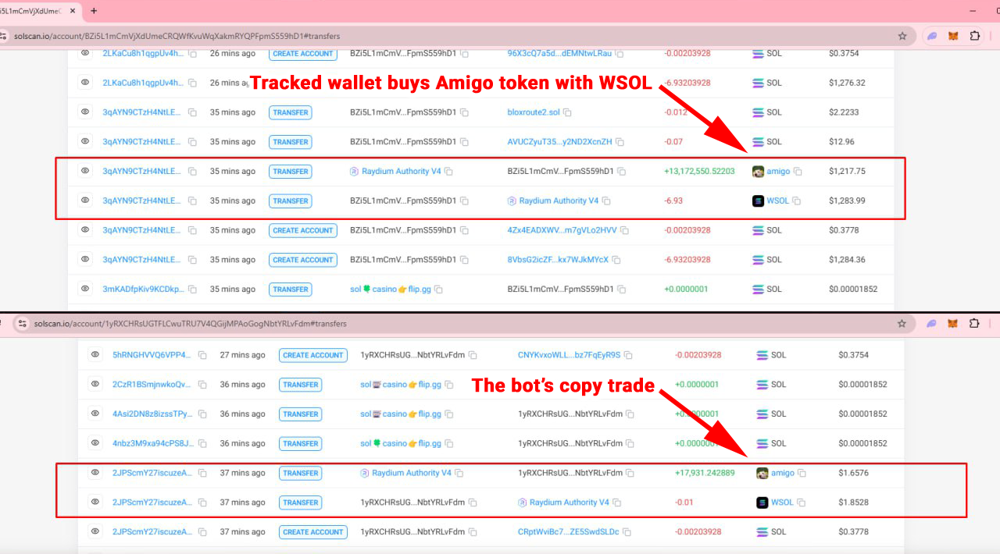
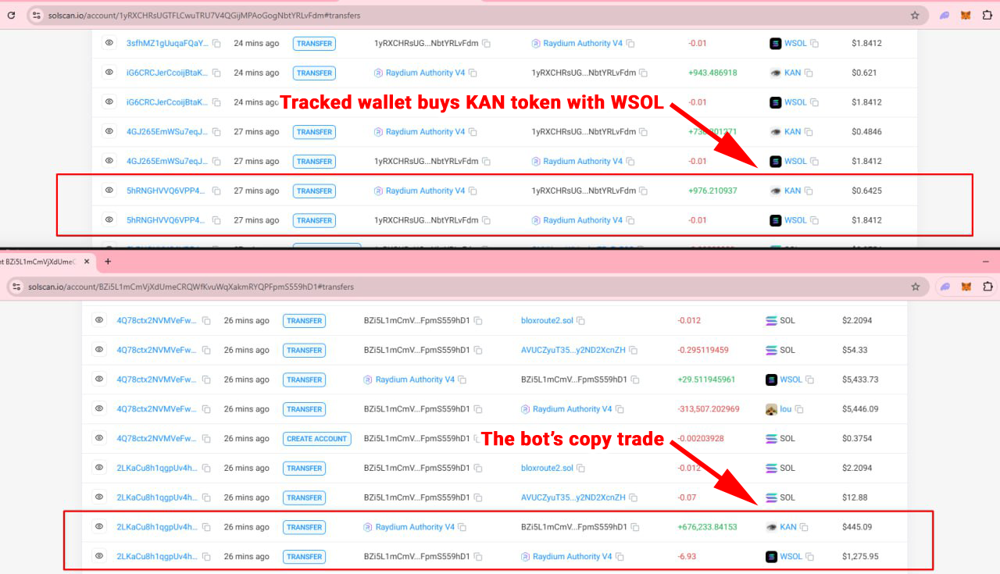

# Solana Copy Trading Bot

## Overview

The Solana Copy Trading Bot is an automated trading solution designed to replicate token buy and sell trades from specific Solana wallets in real time. The bot leverages the Solana blockchain’s capabilities along with the Helius API to monitor target wallets and execute trades based on pre-defined rules such as Take Profit (TP). The bot is designed for Windows environments and is suitable for users with basic to intermediate technical knowledge.

---

## Features

- **Real-Time Trade Copying**:
  - Monitors a single target Solana wallet for buy/sell activity.
  - Automatically replicates trades on your designated wallet.

- **Customizable Trade Parameters**:
  - Define trade size.
  - Set Take Profit (TP) thresholds for trades.

- **Transaction Safety**:
  - Only sells tokens if:
    - The source wallet sells the token.
    - TP targets are triggered.

- **Support for Liquidity Pools**:
  - Integrates with Raydium Liquidity Pool for token swaps.

- **Ease of Use**:
  - Configuration via a single `config.ts` file.
  - Human-readable JSON logs for tracking trades.

- **Requires Wrapped Solana (WSOL)**:
  - The bot uses WSOL for all trading activities. Ensure your wallet has sufficient WSOL before running the bot.
  - Refer to the [Copy Trading - Prepare Wallet with WSOL](copy-trading-get-wsol.pdf) guide for detailed steps to prepare your wallet.

---

## Prerequisites

To run the Solana Copy Trading Bot, ensure you have the following:

1. **Windows Pro PC**
2. **Software Requirements**:
   - Node.js (v16 or higher)
   - TypeScript
   - Yarn (optional, if preferred over npm)
3. **Accounts and API Keys**:
   - A Solana wallet (private key required).
   - Helius RPC API key (for blockchain interaction).
4. **Dependencies**:
   - `@solana/web3.js`
   - `@raydium-io/raydium-sdk`
   - `dotenv`
   - `bs58`

---

## Setup Instructions

### Step 1: Install Required Software

1. Download and install [Node.js](https://nodejs.org/).
2. Verify installation:
   ```
   node -v
   npm -v
   ```

### Step 2: Clone the Repository

1. Clone the repository to your local machine:
   ```
   git clone <repository-url>
   ```
2. Navigate to the project directory:
   ```
   cd copy-trading-bot
   ```

### Step 3: Install Dependencies

Run the following command to install all required dependencies:
```
npm install
```

### Step 4: Install TypeScript

1. Ensure TypeScript is installed globally by running:
   ```
   tsc --version
   ```
2. If TypeScript is not recognized, install it globally:
   ```
   npm install -g typescript
   ```
3. Verify the installation by running:
   ```
   tsc --version
   ```

### Step 5: Compile the Bot

Compile the TypeScript code into JavaScript to generate the `dist` folder:
```
tsc
```

### Step 6: Configure the Bot

1. Open `config.ts` in a text editor.
2. Update the following parameters:
   - `TARGET_WALLET_ADDRESS`: Public key of the wallet to copy trades from.
   - `RAYDIUM_LIQUIDITYPOOL_V4`: Static variable defining the liquidity pool (default: `675kPX9MHTjS2zt1qfr1NYHuzeLXfQM9H24wFSUt1Mp8`).
   - `SOL_ADDRESS`: Static variable defining the wrapped Solana token address (default: `So11111111111111111111111111111111111111112`).
   - `WALLET`: Replace with your private key (base58-encoded).
   - `TRADE_AMOUNT`: Amount of WSOL to use per trade (e.g., `10000000` for 0.01 WSOL).
   - `COMPUTE_PRICE`: A static variable for internal calculations (default: `100000`).
   - `LIMIT_ORDER`: Set Take Profit as a multiplier (e.g., `1.25` for 25% profit, but typically follows the target wallet's actions).
   - `SLIPPAGE`: Input slippage tolerance for trades (default value: `5`).

### Step 7: Start the Bot

Run the bot using:
```bash
npm run start
```

---

## Configuration Guide

### Key Parameters in `config.ts`

| Parameter              | Description                                                                                  |
|------------------------|----------------------------------------------------------------------------------------------|
| `TARGET_WALLET_ADDRESS`| The wallet address to monitor for trades.                                                   |
| `RAYDIUM_LIQUIDITYPOOL_V4` | Static variable for the Raydium Liquidity Pool.                                             |
| `SOL_ADDRESS`          | Static variable for the wrapped Solana token address.                                        |
| `WALLET`               | Your trading wallet’s private key in base58 format.                                         |
| `TRADE_AMOUNT`         | Amount to trade per transaction (in lamports; 1 WSOL = 1,000,000,000 lamports).             |
| `COMPUTE_PRICE`        | A static variable for internal calculations (default: `100000`).                            |
| `LIMIT_ORDER`          | Multiplier for setting Take Profit (TP) above the buy price (e.g., `1.25` for 25% profit).  |
| `SLIPPAGE`             | Maximum allowable price variation during trade execution (default: `5`).                    |

---

## Usage

1. Ensure the bot is running by executing:
   ```bash
   npm run start
   ```
2. Monitor the console for real-time logs of:
   - Tokens bought and sold.
   - Current holdings and performance.

3. Edit `config.ts` to adjust trade parameters and restart the bot if changes are made.

---

## Troubleshooting

| Issue                                     | Solution                                                                              |
|-------------------------------------------|--------------------------------------------------------------------------------------|
| Bot fails to start                        | Verify Node.js and TypeScript installations. Ensure dependencies are installed.       |
| Transactions not being copied             | Check `TARGET_WALLET_ADDRESS` and ensure the Helius API key is valid.                 |
| Unexpected token behavior                 | Ensure `TRADE_AMOUNT` is correctly set in lamports.                                   |
| Logs not updating                         | Check the bot’s connection to the Solana network. Restart if necessary.               |

---

## Example Copy Trades

Below are screenshots illustrating the bot correctly tracking and copying trades from the target wallet:

1. **Copy Trade Example 1**: The tracked wallet buys the `amigo` token by swapping WSOL. The bot copies this trade shortly afterward.

   

2. **Copy Trade Example 2**: The tracked wallet buys the `KAN` token by swapping WSOL. The bot copies this trade shortly afterward.

   

---

## Future Improvements

1. **Support for Multiple Wallets**:
   - Enable tracking and copying trades from multiple Solana wallets simultaneously.

2. **Minimum Value of Tracked Wallet Trade**:
   - Implement a feature to copy trades only if the tracked wallet's trade size exceeds a user-defined threshold, ensuring "high commitment" trades.

3. **Optional Token Liquidity Check**:
   - Implement a feature to evaluate token liquidity during tracked wallet buys and proceed with the trade only if liquidity is sufficient to avoid adverse price impacts.

4. **Optional Stop Loss (SL) Setting for Each Wallet**:
   - Add the ability to specify a Stop Loss percentage for each wallet, triggering an automatic sell if the SL threshold is reached.
   - **Developer response**: "This is impossible because of RPC node server issues. Without our own local node server, we cannot implement subscription-based functions such as a Stop Loss."

5. **Amount of Token to Sell**:
   - **Confirmed**: The bot always sells 100% of tokens held in your wallet when the tracked wallet sells the same token.

6. **Exclude Tokens by Marketplace**:
   - **Confirmed**: The bot only interacts with tokens on Raydium and does not trade tokens from other marketplaces like pump.fun. No further action is needed for this feature.

---

## License

This project is licensed under the MIT License. See `LICENSE` for details.
